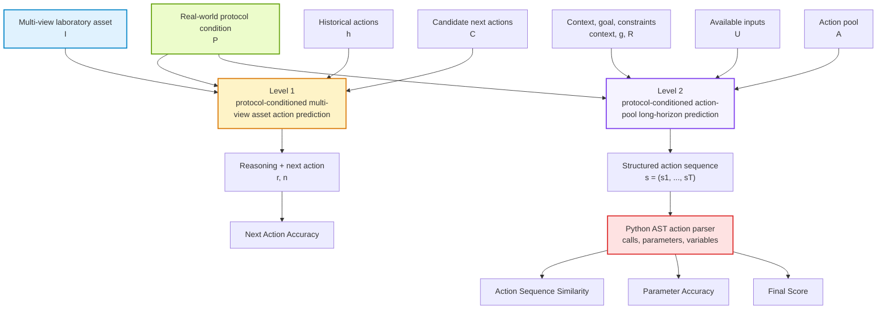
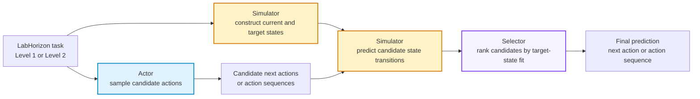

<a id="top"></a>

<div align="center">
  <h1>LabHorizon</h1>
</div>

<div align="center">

[](https://conglab-research.github.io/LabHorizon/)&nbsp;
[](https://github.com/CongLab-Research/LabHorizon)&nbsp;
[](https://huggingface.co/datasets/CongLab-Research/LabHorizon-3D-Asset-Perception)&nbsp;
[](https://huggingface.co/datasets/CongLab-Research/LabHorizon-Protocol-Conditioned-Planning)&nbsp;
[](LICENSE)&nbsp;
[](https://www.python.org/)

**Enhancing Laboratory 3D Perception and Long-Horizon Planning via Protocol-Conditioned Action Prediction**

[Overview](#-overview) | [Explorer](#-github-pages-explorer) | [Datasets](#-datasets) | [Leaderboard](#-leaderboard) | [Agent](#-actor-simulator-selector-agent) | [Quick Start](#-quick-start) | [Citation](#-citation)

</div>

---

## 🔎 Overview

**LabHorizon** is a data and evaluation suite for laboratory action prediction. It studies how models connect multi-view laboratory assets, real-world experimental context, and long-horizon action structure before they can support reliable AI scientist workflows.

Unlike general scientific QA or diagram-based multimodal benchmarks, LabHorizon frames laboratory reasoning as **protocol-conditioned action prediction**: a model must either select the next protocol-consistent action from visually grounded candidates or produce a structured long-horizon experimental action sequence.

### ✨ Highlights

<table>
<tr>
<td align="center" width="25%">🔬<br/><b>3D Asset Perception</b><br/><sub>Multi-view laboratory asset inputs</sub></td>
<td align="center" width="25%">🧭<br/><b>Protocol Action Prediction</b><br/><sub>History and protocol context guide the next action</sub></td>
<td align="center" width="25%">🧪<br/><b>Long-Horizon Planning</b><br/><sub>Structured action sequences with dependencies</sub></td>
<td align="center" width="25%">🌳<br/><b>AST Scoring</b><br/><sub>Action, parameter, and dependency parsing</sub></td>
</tr>
<tr>
<td align="center">📚<br/><b>3,000 + 3,000 Train</b><br/><sub>Training samples across two levels</sub></td>
<td align="center">📊<br/><b>200 + 200 Test</b><br/><sub>Matched evaluation samples</sub></td>
<td align="center">🔌<br/><b>OpenAI-Compatible</b><br/><sub>Works with any compatible model endpoint</sub></td>
<td align="center">♻️<br/><b>Resume Friendly</b><br/><sub>JSONL outputs can be reused across runs</sub></td>
</tr>
</table>

### 🧭 Data and Evaluation Flow



## 🖥️ GitHub Pages Explorer

The `docs/` directory contains a static GitHub Pages explorer for LabHorizon. It keeps the original dark visual style and interactive Three.js laboratory asset viewer, but now focuses on the two released data levels:

- **Level 1:** real public test samples with three rendered asset views, historical actions, candidate next actions, reference reasoning, and gold next action.
- **Level 2:** real public test samples with context, goal, constraints, action pool, and gold structured experimental action sequence.

The page is fully static and can be previewed locally:

```bash
python -m http.server 8765 --directory docs
```

## 📦 Datasets

| Level | Hugging Face Dataset | Input | Target | Metric |
|:---|:---|:---|:---|:---|
| **Level 1** | [LabHorizon-3D-Asset-Perception](https://huggingface.co/datasets/CongLab-Research/LabHorizon-3D-Asset-Perception) | Three asset views, historical actions, candidate next actions | Gold next action | Next-action accuracy |
| **Level 2** | [LabHorizon-Protocol-Conditioned-Planning](https://huggingface.co/datasets/CongLab-Research/LabHorizon-Protocol-Conditioned-Planning) | Context, goal, constraints, available inputs, action pool | Gold experimental action sequence | Action Sequence Similarity, Parameter Accuracy |

### 🔬 Level 1 Schema

| Column | Meaning |
|:---|:---|
| `id` | Stable public sample identifier, such as `LabHorizon-L1-test-000001`. |
| `asset` | Three rendered views of the same laboratory asset. |
| `historical_actions` | Previous protocol actions and the current experimental state. |
| `candidate_next_actions` | Candidate next laboratory actions. |
| `reasoning` | Reference reasoning for the gold next action. |
| `next_action` | Gold protocol-consistent next action. |
| `asset_name` | Human-readable asset name for analysis. |
| `asset_family` | Asset family label for distribution analysis. |

### 🧪 Level 2 Schema

| Column | Meaning |
|:---|:---|
| `id` | Stable public sample identifier, such as `LabHorizon-L2-test-000001`. |
| `context` | Experimental context for the local protocol window. |
| `goal` | Planning objective. |
| `constraints` | Protocol-derived constraints and parameter requirements. |
| `available_inputs` | Raw materials, samples, or measurements available before planning. |
| `action_pool_names` | Names of available action-pool functions. |
| `action_pool` | Python function definitions describing available laboratory actions. |
| `gold_action_sequence` | Gold long-horizon experimental action sequence. |

## 🏆 Leaderboard

The tables below report direct-prompting model results on the current `v20260510-repaired` 200-sample test split. Level 1 is sorted by `Next Action Accuracy`; Level 2 is sorted by `Final Score`.

### 🔬 Level 1: 3D Asset Perception

| Rank | Model | Next Action Accuracy |
|:---:|:---|---:|
| 🥇 | Grok 4.3 | 0.555 |
| 🥈 | Kimi K2.6 | 0.550 |
| 🥉 | GPT-5.5 | 0.535 |
| 4 | GPT-5.4 | 0.520 |
| 5 | Qwen3.6 Plus | 0.505 |
| 6 | Claude Opus 4.7 | 0.500 |
| 7 | Qwen3.5 35B-A3B | 0.495 |
| 8 | MiMo V2.5 | 0.495 |
| 9 | Qwen3.5 9B | 0.485 |
| 10 | Gemini 3.5 Flash | 0.485 |
| 11 | Qwen3.6 35B-A3B | 0.475 |
| 12 | Gemini 3.1 Pro Preview | 0.465 |

### 🧪 Level 2: Protocol-Conditioned Planning

| Rank | Model | Final Score | Action Sequence Similarity | Parameter Accuracy |
|:---:|:---|---:|---:|---:|
| 🥇 | Gemini 3.1 Pro Preview | 0.3263 | 0.3195 | 0.3331 |
| 🥈 | Grok 4.3 | 0.3244 | 0.3339 | 0.3148 |
| 🥉 | Kimi K2.6 | 0.3150 | 0.2845 | 0.3456 |
| 4 | Gemini 3.5 Flash | 0.3039 | 0.2686 | 0.3391 |
| 5 | Qwen3.7 Max | 0.3003 | 0.2905 | 0.3102 |
| 6 | Claude Opus 4.7 | 0.2737 | 0.2619 | 0.2856 |
| 7 | GPT-5.4 | 0.2715 | 0.2191 | 0.3239 |
| 8 | Qwen3.6 35B-A3B | 0.2534 | 0.2585 | 0.2483 |
| 9 | Qwen3.6 Plus | 0.2526 | 0.2264 | 0.2787 |
| 10 | MiMo V2.5 | 0.2491 | 0.2269 | 0.2713 |
| 11 | GLM 5.1 | 0.2413 | 0.2307 | 0.2519 |
| 12 | Qwen3.5 35B-A3B | 0.2391 | 0.2385 | 0.2398 |
| 13 | GPT-5.5 | 0.2276 | 0.2092 | 0.2459 |
| 14 | DeepSeek V4 Pro | 0.2135 | 0.1927 | 0.2342 |
| 15 | Qwen3.5 9B | 0.1315 | 0.1359 | 0.1271 |

## 📏 Evaluation

The evaluator keeps model interaction simple and model-agnostic. It sends natural-language prompts to an OpenAI-compatible chat completions endpoint, stores raw model outputs as JSONL, and computes metrics locally.

### 🔬 Level 1: Next-Action Prediction

Level 1 prompts contain asset images, historical actions, and candidate next actions. The model is asked to reason first and end with:

```text
Final Next Action: X
```

`X` may be a candidate letter or the exact candidate action. The evaluator maps the final response back to the candidate list and reports `next_action_accuracy`.

### 🧪 Level 2: Protocol-Conditioned Planning

Level 2 prompts contain a real-world experimental context, constraints, available inputs, and an action pool. The model may answer in natural language, but the structured action sequence must appear as Python-style function calls, usually inside a fenced code block:

```python
lysate = lyse_cells(sample=cell_pellet, buffer=lysis_buffer, duration_min=10)
clarified = centrifuge(sample=lysate, speed_x_g=12000, duration_min=15)
```

The evaluator uses Python AST to extract action calls, keyword parameters, assigned intermediate variables, and variable dependencies. It reports:

| Metric | What It Measures |
|:---|:---|
| `Action Sequence Similarity` | Whether predicted actions appear at the correct positions relative to the gold sequence. |
| `Parameter Accuracy` | Whether aligned actions use correct parameter keys, values, raw inputs, and generated-variable dependencies. |
| `Final Score` | The mean of Action Sequence Similarity and Parameter Accuracy. |

## 🤖 Actor-Simulator-Selector Agent

LabHorizon includes a bounded **Actor-Simulator-Selector** agent for protocol-conditioned action prediction. The agent is not an open-ended ReAct loop and does not use a physical simulator. It wraps model sampling with a structured experimental state checker:



The implementation in `agents/` uses the same public dataset schema and evaluation contracts as `evaluation/`:

- Level 1 Actor outputs `Final Next Action: X`, then the Selector returns one candidate next action.
- Level 2 Actor outputs a structured action sequence, then AST metrics score the selected sequence.
- The Simulator and Selector can use the same model as the Actor or separate OpenAI-compatible models.

## 🚀 Quick Start

### 1. Clone Code and Data

The recommended local layout keeps code and datasets as sibling repositories:

```bash
mkdir -p LabHorizon/code LabHorizon/data

git clone https://github.com/CongLab-Research/LabHorizon \
  LabHorizon/code/LabHorizon

git clone https://huggingface.co/datasets/CongLab-Research/LabHorizon-3D-Asset-Perception \
  LabHorizon/data/LabHorizon-3D-Asset-Perception

git clone https://huggingface.co/datasets/CongLab-Research/LabHorizon-Protocol-Conditioned-Planning \
  LabHorizon/data/LabHorizon-Protocol-Conditioned-Planning

cd LabHorizon/code/LabHorizon
```

### 2. Install

```bash
python -m pip install -r requirements.txt
```

### 3. Configure

```bash
cp .env.example .env
```

Fill `.env` with an OpenAI-compatible endpoint:

```text
BASE_URL=https://your-openai-compatible-endpoint/v1
API_KEY=your_api_key_here
EVAL_MODEL=openai/gpt-5.4
ACTOR_MODEL=qwen/qwen3.6-35b-a3b
SIMULATOR_MODEL=openai/gpt-5.4
SELECTOR_MODEL=openai/gpt-5.4
```

Do not commit `.env`. It is ignored by default.

### 4. Run Level 1 Evaluation

```bash
python -m evaluation.level1.evaluate \
  --split test \
  --output results/level1_gpt54.jsonl
```

### 5. Run Level 2 Evaluation

```bash
python -m evaluation.level2.evaluate \
  --split test \
  --output results/level2_gpt54.jsonl
```

Each command writes one JSONL row per evaluated sample plus a `.summary.json` file. Use `--resume` to reuse already written rows after interruption.

### 6. Run the Agent

```bash
python -m agents.run_agent \
  --level 2 \
  --split test \
  --samples 4 \
  --limit 5 \
  --output results/agent_level2_demo.jsonl
```

The agent reads `BASE_URL` and `API_KEY` from `.env` by default. Advanced users may set `ACTOR_BASE_URL` / `ACTOR_API_KEY`, `SIMULATOR_BASE_URL` / `SIMULATOR_API_KEY`, and `SELECTOR_BASE_URL` / `SELECTOR_API_KEY` to route the three stages to different endpoints.

### 7. Run Tests

Offline tests validate dataset loading contracts, direct evaluation scoring, AST metrics, and the Actor-Simulator-Selector workflow with fake clients:

```bash
python -m unittest discover tests
python -m unittest discover agents/tests
```

Real API smoke tests are opt-in because they call configured models through `BASE_URL`:

```bash
RUN_LABHORIZON_API_TESTS=1 python -m unittest tests.test_api_smoke
```

The smoke tests run one Level 1 direct-evaluation sample, one Level 2 direct-evaluation sample, and one Level 2 agent sample.

## ⚙️ Useful Options

```bash
python -m evaluation.level1.evaluate --help
python -m evaluation.level2.evaluate --help
python -m agents.run_agent --help
```

| Option | Default | Purpose |
|:---|:---|:---|
| `--data-root` | `../../data` | Directory containing the two Hugging Face dataset clones. |
| `--cache-dir` | `.cache/huggingface/datasets` | Local Hugging Face dataset cache. |
| `--limit` | unset | Evaluate only the first N examples. |
| `--resume` | `False` | Reuse existing JSONL rows in `--output`. |
| `--temperature` | unset | Optional model temperature. |
| `--timeout` | `120` | HTTP timeout in seconds. |
| `--retries` | `2` | API retry count. |

## 📁 Project Structure

```text
LabHorizon/
├── README.md
├── LICENSE
├── requirements.txt
├── .env.example
├── evaluation/
│   ├── utils.py                  # OpenAI-compatible client, dataset loading, JSONL cache
│   ├── level1/
│   │   ├── prompts.py            # Multi-image next-action prompts and answer parsing
│   │   └── evaluate.py           # Level 1 evaluation entry point
│   └── level2/
│       ├── prompts.py            # Protocol-conditioned planning prompts
│       ├── metrics.py            # AST parsing and ASS / PA metrics
│       └── evaluate.py           # Level 2 evaluation entry point
├── agents/
│   ├── run_agent.py              # Actor-Simulator-Selector CLI
│   ├── workflow.py               # Candidate sampling, simulation, selection, scoring
│   ├── prompts.py                # Actor / Simulator / Selector prompts
│   └── tests/                    # Offline smoke tests
└── tests/
    ├── test_evaluation.py        # Direct evaluator unit tests
    ├── test_agent.py             # Agent workflow unit tests
    └── test_api_smoke.py         # Opt-in real API smoke tests
```

Generated outputs should go under `results/`, which is ignored by default.

## 🗺️ Roadmap

- Release paper metadata and citation after the manuscript is public.
- Add official model results and analysis tables.
- Add official agent and fine-tuned model results when checkpoints are released.

## 📜 Citation

Coming soon...

## 💬 Contact

Please open a GitHub issue for reproducibility questions, dataset access problems, or evaluator bugs.

## ⭐ Star History

<a href="https://www.star-history.com/?repos=CongLab-Research%2FLabHorizon&type=date&legend=top-left">
 <picture>
   <source media="(prefers-color-scheme: dark)" srcset="https://api.star-history.com/image?repos=CongLab-Research/LabHorizon&type=date&theme=dark&legend=top-left" />
   <source media="(prefers-color-scheme: light)" srcset="https://api.star-history.com/image?repos=CongLab-Research/LabHorizon&type=date&legend=top-left" />
   
 </picture>
</a>

<p align="right"><a href="#top">Back to top</a></p>
